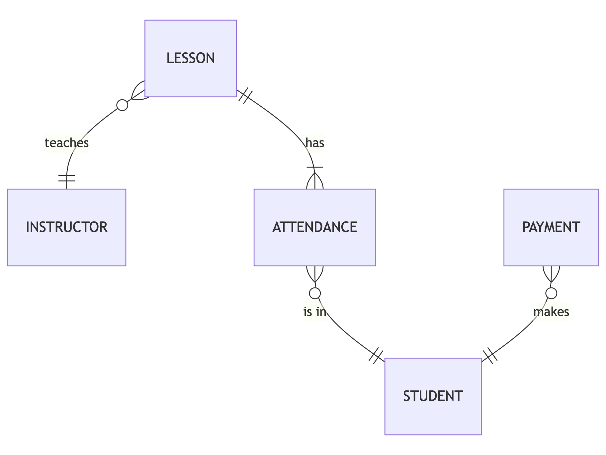

# Design Document

By Tatiana Kulagina

Video overview: https://youtu.be/n00eGz9zKO4

## Scope

The database includes all entities necessary to keep track of attendance and payments of students who attend a university tennis sport club as well as instructors and lessons that were delivered.

As such, included in the database's scope is:

* Students, including basic identifying information along with their tennis level
* Payments, including the maker of a payment along with the amount and the date
* Instructors, including basic identifying information
* Lessons, including instructor, date and place where a lesson took place
* Attendaces, linking a student to a lesson

Out of scope are elements like other students, matches, lesson plans a nd other non-core attributes.

## Functional Requirements

* CRUD operations for students and instructors
* Tracking payments
* Tracking lessons and their attendance

## Representation

Entities are captured in MySQL tables with the following schema.

### Entities

The database includes the following entities:

#### Instructors
* `id`, which specifies the unique ID for the instructor as an `INT UNSIGNED`. This column thus has the `PRIMARY KEY` constraint applied.
* `first_name`, which specifies the instructor's first name as `VARCHAR` with the maximum length of 20 symbols.
* `last_name`, which specifies the instructor's last name. `VARCHAR` with the maximum length of 20 symbols.

#### Lessons
* `id`, which specifies the unique ID for the lesson as an `INT UNSIGNED`. This column thus has the `PRIMARY KEY` constraint applied.
* `instructor_id`, which specifies the id of the instructor who delivered the lesson. This column thus has the `FOREIGN KEY` constraint applied.
* `date`, which specifies the date on which the lesson took place in a `DATE` format as 'YYYY-MM-DD'.
* `court_name`, which specifies the court where the lesson took place as `VARCHAR` with the maximum length of 50 symbols.

#### Students
* `university_id`, which specifies the unique ID given to the student by the university as an `CHAR` with fixed length of 9. This column thus has the `PRIMARY KEY` constraint applied.
* `first_name`, which specifies the student's first name as a `VARCHAR` with the maximum length of 20 symbols.
* `last_name`, which specifies the student's last name. `VARCHAR` with the maximum length of 20 symbols.
* `major`, which specifies one of the given majors from a university as ENUM. In this database the possible majors are: Computer Science, Mathematics, Arts, Economy, Biology, Linguistics.
* `start_date`, which specifies the date of joining the tennis sport club in a `DATE` format as 'YYYY-MM-DD'.
* `end_date`, which specifies the date of leaving the tennis sport club in a `DATE` format as 'YYYY-MM-DD'.

#### Attendancies
* `id`, which specifies the unique ID for the attendance as an `INT UNSIGNED`. This column thus has the `PRIMARY KEY` constraint applied.
* `student_id`, which specifies the id of the student who attended the lesson. This column thus has the `FOREIGN KEY` constraint applied.
* `lesson_id`, which specifies the id of the lesson a student attended. This column thus has the `FOREIGN KEY` constraint applied.

#### Payments
* `id`, which specifies the unique ID for the attendance as an `INT UNSIGNED`. This column thus has the `PRIMARY KEY` constraint applied.
* `student_id`, which specifies the id of the student who attended the lesson. This column thus has the `FOREIGN KEY` constraint applied.
* `amount`, which specifies the amount of money put or withdrawn from a student's balance as a `DECIMAL` not exceeding 5 digits, with 2 digits after the decimal point.
* `payment_date`, which specifies the precise date and time when a payment was made as a `DATETIME` with default set to `CURRENT_TIMESTAMP`.

### Relationships

The below entity relationship diagram describes the relationships among the entities in the database.

As detailed by the diagram:
* One instructor is capable of teaching from zero to many lessons. Zero, if they are a new instructor who does not yet have any lessons. A lesson can have one and only one instructor delivering it.
* One lesson has to have at least one attendance and can have many. Otherwise, there is no lesson without students. Attendance is assigned to one and only one lesson.
* One student is capable of attending from zero to many lessons. Zero, if they have not yet attended any lessons. However, an attendance can have one and only one student for each lesson. One student can not visit the same lesson twice.
* One payment is capable of being made only once by a student. A student can make from zero to many payments. Zero, if they have not made any payments yet.

## Optimizations

Per the typical queries in `queries.sql`, it is common for users of the database to access all students of a particular level in tennis. For that reason, an index is created on the `level_of_play` column to speed the identification of students by their level in tennis.

Similarly, it is also common practice for a user of the database to access payments of a particular student by their id. As such, an index is created on the `student_id` column in the `payments` table to speed the identification of students by their university id.

## Limitations

The main limitation of the current schema assumes that only one instructor is assigned to a lesson. If multiple instructors start coaching the same lessons, it would require changing relationship between lessons and instructors to a many-to-many relationship and creating a separate relation to represent it.
